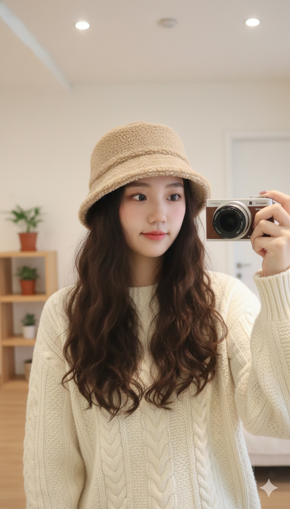

# Coze Hat Content Gen

帽子电商 AI 内容生产工作流：从商品图到小红书风格模特图、短视频和飞书多维表格归档。

这是一个偏 **AI PM / AIGC 电商内容 / 工作流自动化** 的求职作品项目。它展示的是：如何把一个真实电商内容生产痛点，拆成可交付的 AI 工作流，并用 Prompt、模型选型和自动化节点完成端到端闭环。


## 项目亮点

- **真实业务场景**：帽子电商商家需要快速生成小红书风格种草图和短视频素材
- **端到端闭环**：商品图上传 → AI 生图 → AI 生视频 → 文案生成 → 飞书归档
- **模型 A/B 测试**：对比 Nano Banana 与豆包 Seedream，最终选择更符合本土审美的方案
- **Prompt 工程可复用**：沉淀老钱风格、小红书穿搭、场景扩写等提示词规则
- **可交付资产完整**：包含 PRD、Prompt、Coze 工作流 YAML、生成样例和飞书归档截图

## 我想解决的问题

传统电商内容生产通常要经历：

```text
选品/上新
  ↓
找模特、约摄影、布景
  ↓
拍摄与修图
  ↓
反馈不满意后重新拍
  ↓
再整理到团队协作表格
```

这套流程的问题是：

| 痛点 | 传统方式 | 业务影响 |
|------|----------|----------|
| 周期长 | 2-3 天起步 | 新品上架慢，容易错过热点 |
| 成本高 | 模特、摄影、后期成本叠加 | 小商家试错压力大 |
| 反馈慢 | 效果不好要重拍 | 迭代周期长 |
| 风格不稳定 | 依赖摄影师和现场条件 | 品牌视觉难统一 |

这个项目的目标是把内容生产压缩成一个分钟级工作流，让商家可以快速试风格、试场景、试素材。

## 解决方案

```text
帽子正面图 / 侧面图
  ↓
抠图与商品特征提取
  ↓
LLM 生成场景化 Prompt
  ↓
Seedream 生成 8 张同模特、多角度穿搭图
  ↓
Seedance / 视频节点生成短视频
  ↓
LLM 生成小红书/抖音文案
  ↓
图片、视频、文案写入飞书多维表格
```

## 项目成果

| 指标 | 传统方式 | AI 工作流 | 结果 |
|------|----------|-----------|------|
| 内容制作周期 | 2-3 天 | < 10 分钟 | 4000x+ 效率提升 |
| 反馈迭代成本 | 重新拍摄 | 调整 Prompt 后重跑 | 大幅降低 |
| 风格一致性 | 依赖拍摄现场 | Prompt + 模型约束 | 更可控 |
| 团队协作 | 人工整理素材 | 自动写入飞书 | 更易追踪 |

客户 A/B 测试反馈中，豆包 Seedream 输出更符合帽子类目和小红书审美，因此最终选用 Seedream 作为主要生图方案。

## 生成效果

### Seedream 生成样例

| 示例 1 | 示例 2 | 示例 3 |
|--------|--------|--------|
|  |  |  |

### Nano Banana 对比样例

| 示例 1 | 示例 2 | 示例 3 |
|--------|--------|--------|
|  |  |  |

## 工作流设计

### 1. 生图工作流

文件：

- [workflow/maozi_shengtu_3-draft.yaml](workflow/maozi_shengtu_3-draft.yaml)

输入：

- 帽子正面图
- 帽子侧面图
- 场景描述
- 服装要求
- 帽子款式

输出：

- 8 张同模特、同场景、多角度模特图
- 小红书标题
- 小红书正文
- 飞书多维表格记录

### 2. 视频工作流

文件：

- [workflow/maizi_shipin-draft.yaml](workflow/maizi_shipin-draft.yaml)

输入：

- 5 张 AI 生成图
- 帽子款式

输出：

- 5 个短视频
- 抖音风格文案
- 飞书多维表格记录

## Prompt 工程

Prompt 不是简单描述“生成一张好看的图”，而是按优先级设计约束：

1. **商品还原优先**：帽子版型、形状、颜色必须还原参考图
2. **人物一致性**：同一模特、同一服装、同一场景
3. **平台审美锚定**：小红书头部博主、老钱松弛感、胶片颗粒感
4. **商品展示动作**：至少 4 张对镜自拍，多角度展示帽子
5. **负向约束**：避免多人背景、换衣服、夸张动作、假场景

核心 Prompt：

- [prompts/old_money_style_prompt.txt](prompts/old_money_style_prompt.txt)
- [prompts/scene_expansion_rules.txt](prompts/scene_expansion_rules.txt)

## 项目材料

- PRD: [PRD/PRD.md](PRD/PRD.md)
- Prompt: [prompts/](prompts/)
- Coze 工作流: [workflow/](workflow/)
- 生成效果截图: [screenshots/](screenshots/)

## 文件结构

```text
coze-hat-content-gen/
├── PRD/
│   └── PRD.md
├── prompts/
│   ├── old_money_style_prompt.txt
│   └── scene_expansion_rules.txt
├── workflow/
│   ├── maozi_shengtu_3-draft.yaml
│   └── maizi_shipin-draft.yaml
├── screenshots/
└── README.md
```

## 如何复现

### 前置条件

- Coze / 扣子工作流账号
- 豆包 Seedream / Seedance 相关能力
- 飞书开放平台应用
- 飞书多维表格

### 使用步骤

1. 克隆仓库

```bash
git clone https://github.com/lindixu6-hash/coze-hat-content-gen.git
cd coze-hat-content-gen
```

2. 查看 PRD 和 Prompt

```bash
cat PRD/PRD.md
cat prompts/old_money_style_prompt.txt
```

3. 导入或参考 Coze 工作流

```bash
ls workflow/
```

4. 替换占位配置

工作流文件中已经将敏感配置替换为占位符：

- `YOUR_SEEDREAM_API_KEY`
- `YOUR_FEISHU_BITABLE_APP_TOKEN`
- `YOUR_FEISHU_TABLE_ID`

请在自己的 Coze / 飞书环境中替换为实际配置。

## 安全说明

这个仓库不应提交真实 API Key、飞书 app_token、table_id 或客户隐私数据。  
如果你 fork 或复用这个项目，请确认工作流中的平台配置已脱敏。

## 这个项目体现的能力

如果用于 AI PM / AIGC 产品 / 电商工具方向求职，可以重点展示：

- **需求拆解能力**：从电商内容生产痛点拆出可自动化链路
- **AIGC 产品设计能力**：把生图、生视频、文案和协作表格串成闭环
- **Prompt 工程能力**：将审美、动作、商品还原和负向约束结构化
- **模型选型能力**：通过 A/B 测试选择更符合业务目标的模型
- **工作流搭建能力**：用 Coze 和飞书完成低代码自动化交付
- **商业交付意识**：项目成果触发后续童帽工作流、选股智能体等合作机会

## 下一步优化

- 支持更多帽型：鸭舌帽、渔夫帽、贝雷帽、童帽等
- 增加男帽和儿童模特生成模板
- 增加生成效果评分表，用于模型和 Prompt eval
- 支持按平台自动生成不同文案：小红书、抖音、淘宝详情页
- 增加素材审核节点，减少畸形图和商品还原偏差

## License

本项目仅供学习、作品集展示和交流使用。
