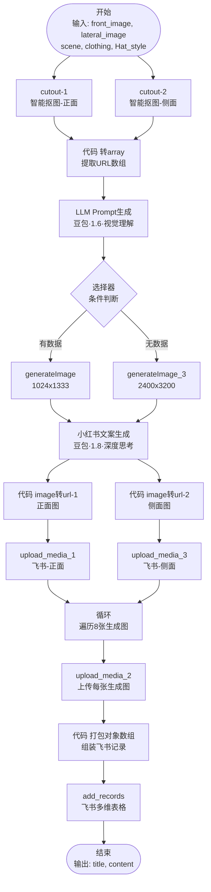
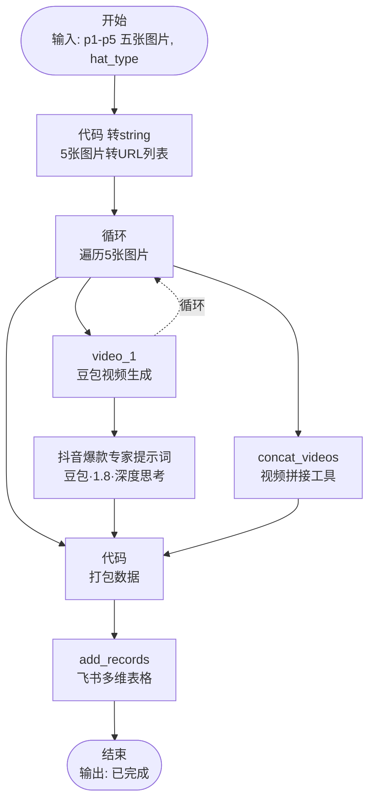

# Coze 电商 AI 内容生成工作流 - 帽子类目

> 独立主导的 AI 内容生产闭环项目，将帽子电商内容制作周期从**人工几天**压缩至**端到端分钟级**，效率提升 **4000+ 倍**。

## 项目概述

### 背景 & 痛点

传统帽子电商内容生产存在以下核心痛点：

| 痛点 | 传统方式 | 影响 |
|------|----------|------|
| **制作周期长** | 需要预约模特、摄影场地、后期修图，耗时数天 | 新品上架慢，错过销售窗口期 |
| **成本高昂** | 单次拍摄成本数千元，多款式成本叠加明显 | 小批量试错成本高，难以快速迭代 |
| **风格一致性差** | 不同场次拍摄风格难以统一 | 品牌视觉形象分散 |
| **反馈成本高** | 效果不满意需重新拍摄 | 时间和资金双重浪费 |

### 解决方案

基于 **Coze 工作流平台**，从零搭建帽子电商 AI 内容生产闭环：

```
上传商品图 → 多模态模型生成 → 自动批量上传飞书
     ↓              ↓                    ↓
  参考图输入    8张模特图 + 5个短视频    结构化管理
```

### 核心功能

- **自动生成小红书风格真人博主图**：8 张同模特、同场景、多角度连拍
- **自动生成短视频**：5 个 3s 短视频，适配短视频平台
- **自然语言配置**：支持自定义服装风格、场景、拍摄角度
- **批量飞书同步**：一键上传至飞书多维表格，便于团队协作
- **老钱松弛感风格**：主打"老钱风"审美，契合当前小红书头部博主调性

---

## 技术方案

### 模型选型 A/B 测试

针对生图模型进行了 **A/B 对比测试**：

| 模型 | 技术底座 | 客户反馈 | 结论 |
|------|----------|----------|------|
| Nano Banana | Gemini 2.5 Flash Image | - | - |
| 豆包 Seedream 4.5 | 字节跳动自研 | **"效果更好"** | ✅ 选用 |

> **客户原话**："还是豆包 Seedream 4.5 生成的效果更好，更符合国人审美。"

### 工作流架构

#### 工作流 1：生图工作流 (maozi_shengtu_3)



#### 工作流 2：视频工作流 (maizi_shipin)



#### 工作流说明

**生图工作流 (maozi_shengtu_3)**
- **输入**：帽子正面图、侧面图、场景描述、服装要求、帽子款式
- **核心处理**：
  1. 智能抠图提取帽子主体（生成 mask）
  2. LLM 生成场景化生图 Prompt
  3. Seedream 4.5 生成 8 张模特图（双分辨率容错）
  4. LLM 生成小红书文案（标题 + 正文）
  5. 循环上传所有图片到飞书云文档
  6. 打包数据写入飞书多维表格
- **输出**：小红书标题、文案，飞书记录链接

**视频工作流 (maizi_shipin)**
- **输入**：5 张 AI 生图 + 帽子款式
- **核心处理**：
  1. 转换图片为 URL 列表
  2. 循环调用豆包 Seedance Pro 生成 5 个 3s 视频
  3. LLM 生成抖音爆款文案
  5. 打包数据写入飞书多维表格
- **输出**：5 个视频链接 + 抖音文案

---

## Prompt 工程核心

### 生成小红书穿搭风格 Prompt

```
你是小红书穿搭提示词专家。根据用户输入的 {{scene}}（场景描述）和{{clothing}}（服装饰品要求）输出 300字以内 生图 Prompt。

必须严格遵守：

最优先：100%还原{{front_image}}{{lateral_image}}这两个参考图里面的帽子的版型、形状、颜色。

要求：同一模特、模特的长相不允许发生变化、同一场景、同一服装。

人物与形象： 中国面孔，大众脸美女，可参考明星卢昱晓长相，气质可参考35岁高圆圆/董洁，年龄28-32岁。

画面与构图： 产出一组8张同一人物、同一场景、同一服装、姿势不同连拍。3:4竖版，胶片颗粒感，秋冬氛围，85mm焦距，模仿小红书头部博主审美。

服装风格：契合当前场景、季节、温度。质感好，拒绝大Logo、夸张印花、紧身衣。合身剪裁，选经典款。穿搭要求给人很有品味、很会穿搭的感觉。（若滑雪场，为滑雪服）

妆容： 自然感，腮红适量加重。

配饰： 精简，显品质与财力（如细珍珠项链、简约腕表）。

场景扩写：  根据用户输入的  {{scene}}进行扩写。若为居家，场景为室内简约居家环境（米白色墙面+木质地板）、法式奶油风；户外扩写为高级咖啡馆/美术馆。场景尽可能简约，不要出现很假的场景。

动作： 至少4张对镜自拍，手持复古CCD相机/苹果手机，若为相机，要求小巧精致。姿势可为坐椅托腮举机侧脸展帽，蹲姿举手机对镜自拍，或站姿单手叉腰举手机对镜自拍。对镜拍需稍微转头，多角度展示帽子。同一组图只允许使用一种道具。

禁止： 背景不允许出现其他人。表情自然松弛。不允许换衣服。不允许场景很跳脱。不允许很奇怪的动作。严禁出现不自然的仰头或扭曲姿态。

输出要求： 直接输出提示词正文，严禁任何开场白，严禁超过300字。
```

### Prompt 设计亮点

1. **结构化约束**：按优先级分层（最优先 → 要求 → 禁止）
2. **风格锚定**：用明星参考（卢昱晓、高圆圆、董洁）确保输出稳定
3. **场景自适应**：支持居家/户外/滑雪场等多场景扩写
4. **动作指导**：明确至少 4 张对镜自拍，保证帽子多角度展示

---

## 项目成果

### 量化数据

| 指标 | 传统方式 | AI 工作流 | 提升幅度 |
|------|----------|-----------|----------|
| 内容制作周期 | 2-3 天 | < 10 分钟 | **4000x+** |
| 反馈成本 | 重新拍摄（数千元） | 调整 Prompt 重跑 | **降低 ~80%** |
| 风格一致性 | 低（依赖摄影师） | 高（Prompt 决定） | - |

### 客户反馈

> "还是豆包 Seedream 4.5 生成的效果更好。"
> —— 帽子电商客户 A/B 测试反馈

### 后续合作

基于本项目成果，已与客户开展**童帽工作流**和**选股智能体**合作。

---

## 如何复现

### 前置要求

- Coze 账号（[coze.cn](https://coze.cn)）
- 豆包 Seedream 4.5 API 访问权限
- 飞书开放平台应用（用于多维表格写入）

### 快速开始

1. **克隆本仓库**
   ```bash
   git clone https://github.com/lindixu6-hash/coze-hat-content-gen.git
   ```

2. **查看 PRD 文档**
   ```bash
   cat PRD/PRD.md
   ```

3. **使用 Prompt 模板**
   ```bash
   cat prompts/old_money_style_prompt.txt
   ```

4. **在 Coze 创建工作流**
   - 参考 `/workflow/` 目录下的截图
   - 配置 Seedream 4.5 插件节点
   - 配置飞书多维表格写入节点

---

## 文件结构

```
coze-hat-content-gen/
├── README.md              # 本文件
├── PRD/
│   └── PRD.md            # 完整产品需求文档
├── prompts/
│   ├── old_money_style_prompt.txt    # 老钱风格生成 Prompt
│   └── scene_expansion_rules.txt     # 场景扩写规则
├── screenshots/
│   ├── ab_test_comparison.png        # A/B 测试对比图
│   ├── generated_output.png          # 最终生成效果示例
│   ├── lark_table.png                # 飞书表格批量上传效果
│   └── customer_feedback.png         # 客户反馈截图
└── workflow/
    ├── coze_workflow_overview.png    # Coze 工作流全景
    ├── seedream_node_config.png      # Seedream 节点配置
    └── lark_node_config.png          # 飞书节点配置
```

---

## 反思 & 迭代

### 已完成的优化

- [x] 模型选型：通过 A/B 测试确定 Seedream 4.5 为最优解
- [x] Prompt 迭代：从通用 Prompt 细化为场景自适应 Prompt
- [x] 工作流闭环：打通生图 → 飞书的完整链路

### 未来迭代方向

- [ ] 支持更多帽型（鸭舌帽、渔夫帽、贝雷帽等）
- [ ] 支持男帽模特生成
- [ ] 加入自动文案生成（小红书标题、正文、标签）
- [ ] 支持直接发布到小红书 API（如开放）

---

## 许可证

本项目仅供学习交流使用。

---

## 联系方式

- GitHub: [@lindixu6-hash](https://github.com/lindixu6-hash)
